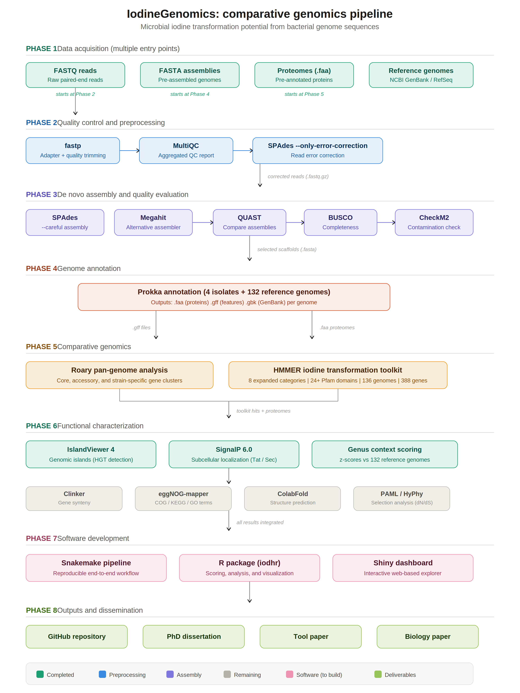

# IodineGenomics

**Comparative genomics pipeline for microbial iodine transformation**

[](LICENSE)



## Overview

IodineGenomics is a reproducible bioinformatics pipeline, R package, and Shiny dashboard for identifying, scoring, and visualizing microbial iodine transformation potential from bacterial genome sequences.

The pipeline accepts multiple input types (FASTQ reads, FASTA assemblies, or pre-annotated proteomes) and performs:

- **Quality control** — fastp trimming, MultiQC reporting, SPAdes error correction
- **De novo assembly** — SPAdes and Megahit with QUAST comparison, BUSCO and CheckM2 validation
- **Annotation** — Prokka for uniform gene calling across isolates and references
- **Pan-genome analysis** — Roary for core, accessory, and strain-specific gene identification
- **Iodine toolkit search** — HMMER against 8 expanded functional categories (24+ Pfam domains, 136 genomes)
- **Functional characterization** — IslandViewer 4 (genomic islands), SignalP 6.0 (signal peptides), genus-level context scoring (z-scores)
- **Remaining analyses** — Clinker (synteny), eggNOG-mapper (COG/KEGG/GO), ColabFold (structure prediction), PAML/HyPhy (selection analysis)

## The science

This tool was developed to study four bacterial isolates from the **Hanford Nuclear Site** (Washington State, USA) that display strikingly different iodine transformation phenotypes despite coexisting in the same contaminated aquifer:

| Isolate | Species | Phenotype |
|---------|---------|-----------|
| DVZ24 | *Pseudomonas mosselii* | High iodide oxidizer |
| DVZ6 | *Pseudomonas mosselii* | Moderate iodide oxidizer |
| DVZ29 | *Enterobacter hormaechei* | Iodate reductase specialist |
| DVZ60 | *Cupriavidus necator* | Metal resistance persister |

## The 8-category iodine transformation toolkit

| # | Category | What it detects |
|---|----------|----------------|
| 1 | Multicopper oxidases (MCOs) | Iodide oxidation enzymes |
| 2 | Cross-reactive reductases | Iodate reduction enzymes |
| 3 | Moco biosynthesis | Cofactor production for reductases |
| 4 | Key regulators | Transcriptional control of iodine pathways |
| 5 | TAT secretion machinery | Periplasmic export system |
| 6 | Dehalogenases | Organohalide metabolism |
| 7 | Copper homeostasis | Copper supply and efflux balance |
| 8 | Cytochrome oxidases | Terminal electron acceptors |

Users can add custom Pfam domains and gene targets through the configuration file.

## Software components

| Component | Description | Status |
|-----------|-------------|--------|
| **Snakemake pipeline** | Reproducible end-to-end workflow from reads to results | In development |
| **R package (iodhr)** | Scoring functions, statistical analysis, and visualization | In development |
| **Shiny dashboard** | Interactive web-based exploration of results | In development |

## Installation

```bash
# Clone the repository
git clone https://github.com/oluwatomiwajubilee/iodine-genomics.git
cd iodine-genomics
```

Detailed installation instructions coming soon.

## Current status

**Completed:**
- Quality control and preprocessing (fastp, MultiQC, SPAdes error correction)
- De novo assembly and evaluation (SPAdes, Megahit, QUAST, BUSCO, CheckM2)
- Prokka annotation (4 isolates + 132 reference genomes)
- Pan-genome analysis (Roary)
- HMMER expanded toolkit search (8 categories, 24+ Pfam domains, 136 genomes)
- IslandViewer 4 genomic island detection
- SignalP 6.0 signal peptide prediction
- Genus-level context scoring (z-scores vs 132 references)

**In progress:**
- Clinker gene synteny analysis
- eggNOG-mapper functional enrichment
- ColabFold structure prediction
- PAML/HyPhy selection analysis
- Snakemake pipeline development
- R package and Shiny app development

## Citation

If you use this pipeline, please cite:

> Sunbare-funto, O.J. (2026). Divergent Genomic Strategies Underlie Microbial Iodine
> Transformation and Persistence in a Multi-Contaminant Subsurface Environment.
> PhD Dissertation, Howard University.

## License

This project is licensed under the MIT License — see [LICENSE](LICENSE) for details.
